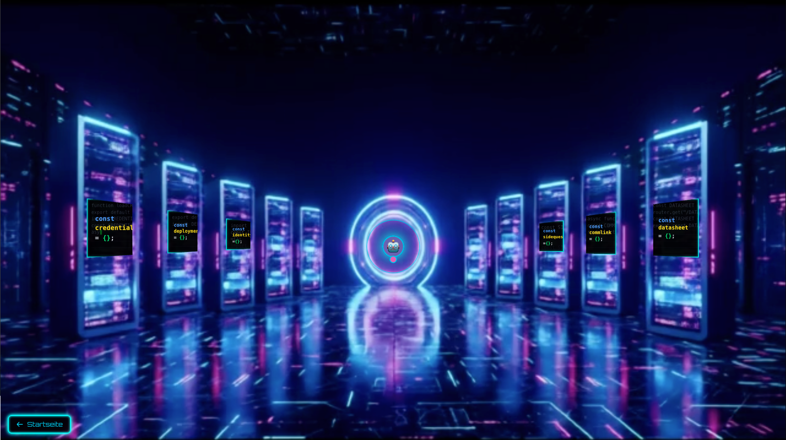
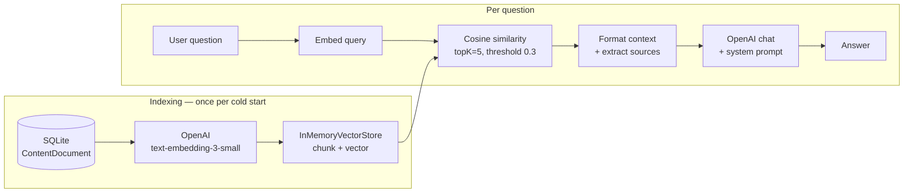

# 🌐 Cyberpunk Developer HUB

**A spatial portfolio with a retrieval-augmented chatbot built from the primitives up — embeddings, a hand-written vector store, cosine retrieval. No LangChain, no vector database.**


**▶ Live demo: [b-riemer.github.io/cyberpunk-portfolio-hub](https://b-riemer.github.io/cyberpunk-portfolio-hub/)**



> ⚠️ **The live demo runs in Static Showcase Mode.** The interface is fully interactive, but the AI core is offline — GitHub Pages serves static files and cannot execute the API routes. Run it locally with an OpenAI key to see the RAG pipeline work. The *why* is in [Trade-offs](#trade-offs), and it is the most interesting part of this project.

---

## What this project demonstrates

I wanted to understand retrieval-augmented generation by building it, not by importing it. So the RAG layer here has no framework underneath it: the embedding call, the similarity search, the chunk formatting and the fallback strategy are all in this repo, in ~550 lines under `lib/` you can read end to end.

The portfolio content itself is the corpus — the chatbot answers questions about me by retrieving from a Prisma-backed knowledge base rather than from a hard-coded prompt.

---

## How the RAG pipeline works



**The pieces, and where they live:**

| Step | File | What it does |
|---|---|---|
| Knowledge base | `prisma/schema.prisma` | `ContentDocument` — title, section, content, tags |
| Seeding | `prisma/seed.ts` ← `content/website-content.ts` | Portfolio content becomes the corpus |
| Embedding | `lib/embeddings/openai-embeddings.ts` | Batched `text-embedding-3-small`, with typed error mapping for quota / rate-limit / auth |
| Storage | `lib/vector-store/in-memory-store.ts` | Singleton store, hand-written cosine similarity |
| Retrieval | `lib/rag/rag-service.ts` | topK search, context formatting, source extraction |
| Generation | `app/_api/chat/route.ts` | System prompt + retrieved context → chat completion |

### The retrieval cascade

A naive similarity search returns nothing when the user phrases a question unexpectedly — and "no results" is the worst possible chatbot answer. So retrieval degrades in three steps instead of failing:

1. **Cosine search** at `similarityThreshold: 0.3`.
2. **Threshold relaxation** to `0.1` if that returns nothing.
3. **Weighted keyword scoring** as a last resort — title hits score 3, section 2, content and tags 1 each.

That third tier is not elegant, but it's the difference between "I don't know" and a useful answer when someone types a single unusual noun.

---

## Trade-offs

**1. Static export bought free hosting and cost the AI.**

`next.config.ts` sets `output: "export"`, which pre-renders everything to static HTML so GitHub Pages can serve it at zero cost via GitHub Actions. Static export has no server, so route handlers don't ship. `ChatBot.tsx` detects the resulting 404 and degrades gracefully:

```
// SYSTEM NOTICE: Running in Static Showcase Mode. AI Core offline.
```

The honest reading: I optimised for a link a recruiter can open, and accepted that the most technically interesting part of the project isn't reachable through it. Deploying to Vercel instead would restore the API routes — that's on the roadmap.

**2. A hand-written vector store instead of pgvector or Pinecone.**

Deliberate — the point was to understand the mechanics. `InMemoryVectorStore` does a linear scan with cosine similarity over every chunk. At this corpus size (dozens of documents) that's microseconds and the simplicity is worth it. It would be the wrong choice at thousands of documents, and it has real costs: vectors are never persisted, so every cold start re-embeds the entire corpus and pays for it.

**3. SQLite via Prisma.**

The corpus is authored, versioned and small. A file-backed database keeps setup to one `db:seed` command with no service to provision. It's also why this doesn't deploy to a serverless host unchanged — a writable SQLite file needs a persistent filesystem.

---

## Tech stack

| Layer | Choice |
|---|---|
| Framework | Next.js 16 (App Router, static export) |
| UI | React 19 + React Compiler, Tailwind CSS v4, Framer Motion |
| AI | OpenAI `text-embedding-3-small` + chat completions |
| Data | Prisma 6 + SQLite |
| Deploy | GitHub Actions → GitHub Pages |

**Interface features:** spatial 3D hub built with perspective transforms, `.mp4` warp transition from the landing portal into the hub, horizontal pan-gesture navigation on mobile, sound effects, and modal cards for résumé, credentials, projects and contact.

---

## Known limitations

- **The chat route is unreachable even on a server host.** The handlers live in `app/_api/`, and a leading underscore marks a Next.js *private folder* — it is excluded from routing. `ChatBot.tsx` fetches `/api/chat`, which therefore 404s regardless of hosting. Renaming `_api/` → `api/` is a prerequisite for any non-static deployment.
- **`typescript: { ignoreBuildErrors: true }`** in `next.config.ts`. This was set to unblock a deploy and never reverted. It means the production build compiles over real type errors — the honest fix is to remove the flag and work through what it surfaces.
- **Language detection is a substring heuristic.** `detectLanguage()` counts German and English stopwords with `includes()`, so `"the"` matches inside `"theme"` and `"ist"` inside `"list"`. It works often enough to feel right and is wrong more than it looks.
- **No persistence of embeddings.** Every cold start re-embeds the whole corpus. A cached vector file or a pgvector column would fix this.
- **No rate limiting or auth on the chat route.** Once deployed to a real host, an exposed endpoint calling a paid API needs both.
- **Chunking config is declared but unused.** `RAGConfig` carries `chunkSize` / `chunkOverlap`, but documents are embedded whole — one document, one vector. Fine for short sections, lossy for long ones.
- **No automated tests.**

---

## Roadmap

- [ ] Rename `app/_api/` → `app/api/` and deploy to Vercel so the AI core is live
- [ ] Remove `ignoreBuildErrors` and fix what appears
- [ ] Persist embeddings so cold starts don't re-index
- [ ] Real chunking with overlap for longer documents
- [ ] Rate limiting on the chat endpoint
- [ ] Replace the stopword heuristic with a proper language detector
- [ ] Show retrieved sources in the chat UI (`extractSources()` already returns them)

---

## Running locally

Local is where this project is complete — the RAG pipeline needs a server and an API key.

```bash
git clone https://github.com/B-Riemer/cyberpunk-portfolio-hub.git
cd cyberpunk-portfolio-hub
npm install
```

Create `.env.local`:

```env
OPENAI_API_KEY=sk-proj-...
DATABASE_URL="file:./dev.db"
```

Then seed the knowledge base and start:

```bash
npm run db:push     # create the SQLite schema
npm run db:seed     # load content/website-content.ts into ContentDocument
npm run dev
```

> To exercise the chatbot you currently also need to rename `app/_api/` to `app/api/` — see *Known limitations*.

Useful scripts: `npm run db:studio` (browse the corpus), `npm run db:generate` (regenerate the Prisma client).

---

## Project layout

```
app/
├── page.tsx              # landing portal → warp transition
├── hub/                  # the spatial hub
└── _api/                 # chat + test-rag route handlers (see limitations)
components/
├── hub/                  # ChatBot, cards, modals, node buttons
└── VideoLanding/         # portal intro
lib/
├── rag/rag-service.ts    # retrieval, context formatting, sources
├── vector-store/         # in-memory cosine store
├── embeddings/           # OpenAI embedding client
└── db.ts                 # Prisma client
prisma/                   # schema + seed
content/website-content.ts # the corpus, in source control
```

Further notes: [`DATABASE.md`](./DATABASE.md) · [`DATA_MIGRATION.md`](./DATA_MIGRATION.md) · [`ENV_SETUP.md`](./ENV_SETUP.md)

---

**Built by [Björn Riemer](https://github.com/B-Riemer)** · [b-riemer.dev](https://b-riemer.dev) · Portfolio project, Fachinformatiker AE (IHK)
